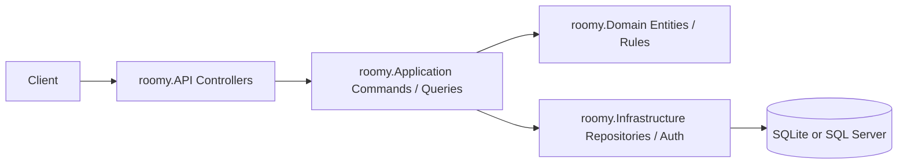

# roomy

Backend-first implementation of the nerdware coding challenge, focused on clean layering, authorization rules, and booking/occupancy workflows.

## Focus
This submission intentionally prioritizes **Backend + Architecture** over frontend polish. The goal was to deliver a working API with clean separation of concerns and enough product coverage to validate the domain quickly.

## Architecture
The solution is split into four projects:

- `roomy.API` - HTTP endpoints, middleware, authentication setup
- `roomy.Application` - CQRS commands/queries, DTOs, use-case orchestration
- `roomy.Domain` - entities and core business rules
- `roomy.Infrastructure` - EF Core persistence, repositories, auth helpers

### Why this structure
- **Clean Architecture** keeps business rules outside controllers and infrastructure.
- **CQRS with MediatR** keeps use cases small and explicit.
- **JWT auth** keeps the prototype stateless and easy to run locally.
- **EF Core** makes it easy to swap between local SQLite and containerized SQL Server.

## Implemented backlog items

| Story | Status | Notes |
|---|---|---|
| #1 Admin login | Done | Default admin user is seeded |
| #2 Create office | Done | Admin only |
| #3 Edit office | Done | Admin only |
| #4 Create admins/employees | Done | Admin only |
| #5 Employee login | Done | Uses same JWT flow |
| #6 Office occupancy as lists | Done | Single-day and ranged list views |
| #7 Office occupancy as calendar | Done | Monthly calendar endpoint |
| #8 Plan attendance / book slot | Done | Capacity validation included |
| #9 Show my bookings | Done | `GET /api/bookings/me` |
| #10 Edit booking | Done | Owner or admin |
| #11 Delete booking | Done | Soft-cancel, owner or admin |

## Authorization rules
- **Admin** can perform every employee action and can manage other users' data.
- **Employee** can only update or cancel their own bookings.
- **Employees** can read office availability and their own bookings.

## Domain assumptions
- A booking represents attendance for a specific day.
- Occupancy is calculated per day using active, non-cancelled bookings.
- A user cannot hold duplicate active bookings for the same office and date.
- Booking deletion is implemented as a **soft cancel** using `CancelledAt`.

## API overview

### Auth
- `POST /api/auth/login`

### Users
- `POST /api/users` - admin creates employee/admin

### Offices
- `POST /api/offices` - create office
- `PUT /api/offices/{id}` - update office
- `GET /api/offices` - list offices
- `GET /api/offices/{id}` - get single office
- `GET /api/offices/{id}/availability?date=2026-01-15`
- `GET /api/offices/{id}/availability/range?fromDate=2026-01-15&toDate=2026-01-21`
- `GET /api/offices/{id}/calendar?year=2026&month=1`

### Bookings
- `POST /api/bookings` - create booking
- `PUT /api/bookings/{id}` - update booking
- `DELETE /api/bookings/{id}` - cancel booking
- `GET /api/bookings/me` - current user bookings
- `GET /api/bookings/user/{userId}` - admin or owner

## Local run

### Option 1: Docker Compose
```bash
docker-compose up --build
dotnet run --project src/roomy.API
```

API base URL:
- `http://localhost:5000`

### Option 2: Run from Visual Studio / dotnet
The API falls back to SQLite for local development when no SQL Server connection string is provided.

## Default admin
- Email: `admin@roomy.local`
- Password: `admin123`

## Example workflow
1. Login with the default admin.
2. Create an employee with `POST /api/users`.
3. Create an office with `POST /api/offices`.
4. Login as the employee.
5. Book attendance with `POST /api/bookings`.
6. Check occupancy with the availability or calendar endpoints.

## Testing
Current automated tests cover:
- office creation
- office availability
- availability range
- booking creation
- booking update
- booking cancellation
- user creation
- authorization/capacity failure paths for key handlers

## Trade-offs
- No frontend was built; backend depth was prioritized.
- `EnsureCreated()` is used for prototype simplicity instead of a full migration flow.
- Password hashing is intentionally simple for the challenge prototype and would be replaced by ASP.NET Identity or a stronger password strategy in production.

## What I would do next
- add FluentValidation to request pipelines
- add Swagger/OpenAPI and endpoint examples
- replace `EnsureCreated()` with EF Core migrations
- add integration tests against the real API and database
- add refresh tokens / stronger identity management
- add frontend/dashboard matching the provided mockup

## Architecture sketch

